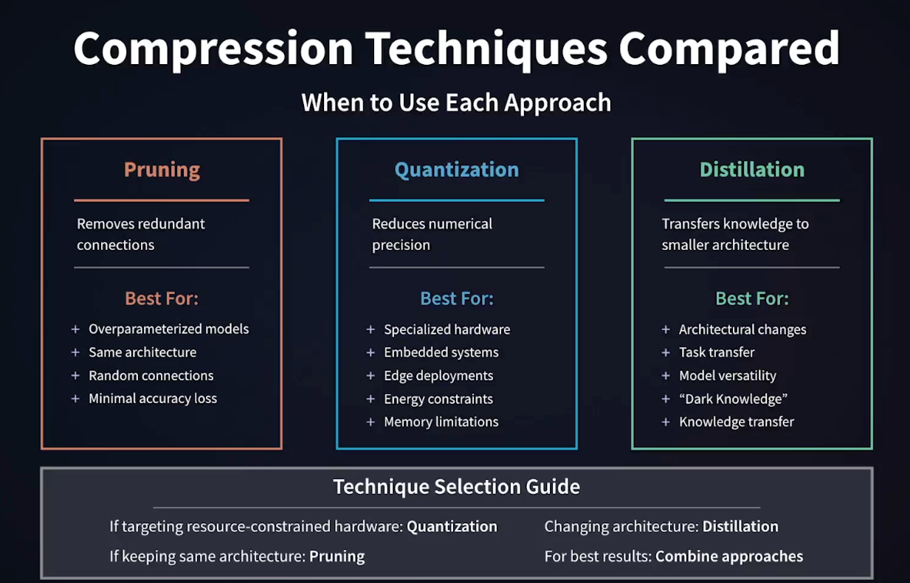
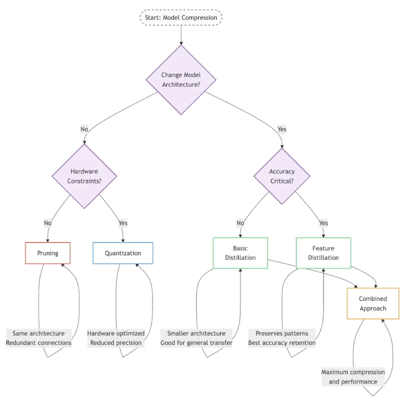
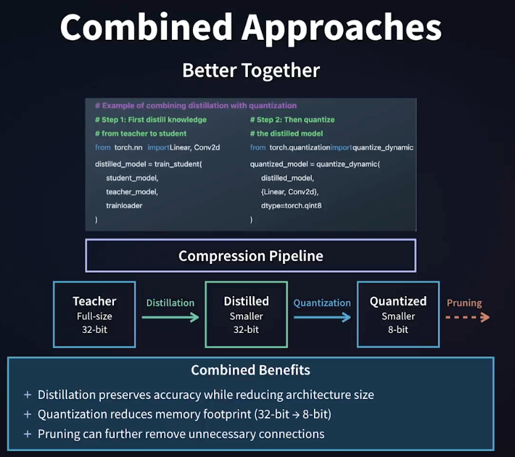
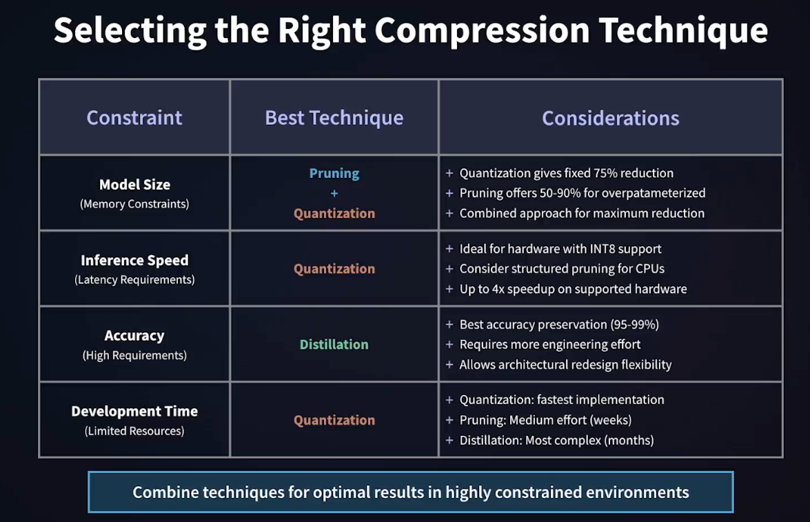

# AI Model Compression: Knowledge Distillation, Pruning, and Quantization

<p>
  
</p>

[img source](https://www.linkedin.com/learning/ai-model-compression-techniques-building-cheaper-faster-and-greener-ai/what-is-sustainable-ai?autoSkip=true&resume=false&u=35754684)

## Project Description

This project provides background educational materials and completes exercise files for the LinkedIn course: [AI Model Compression Techniques Building Cheaper Faster and Greener AI](https://www.linkedin.com/learning/ai-model-compression-techniques-building-cheaper-faster-and-greener-ai/what-is-sustainable-ai?autoSkip=true&resume=false&u=35754684)

The project explores how to make AI/ML models more efficient, cost-effective, and environmentally friendly. It dives into practical techniques such as **pruning**, **quantization**, and **knowledge distillation**. In the project, one can learn how to reduce model size and memory usage without significantly compromising accuracy. It uses hands-on coding exercises in PyTorch to implement these techniques and fine-tune models for optimal performance. The project builds one's understanding of how to balance accuracy, efficiency, and sustainability, giving one the tools to build smarter, faster, and greener AI systems. Whether building edge AI applications, deploying models at scale, or seeking to lower carbon footprints, this course equips provides actionable strategies to address real-world challenges in AI.

### The Learning Objectives Achieved by this Project

- Explain the motivations for model compression in AI/ML and its benefits in terms of memory usage, cost savings, sustainability, and real-world applications like edge deployment.

- Understand and apply key model compression techniques such as pruning, quantization, and knowledge distillation, and evaluate their trade-offs.

- Implement model compression techniques in PyTorch through hands-on coding exercises, and measure their impact on model size, inference speed, and accuracy.

- Evaluate the environmental and business impact of model compression by analyzing how compressed models reduce carbon footprints and operational costs.

### My Solution

I build multiple Python coded Jupyter notebooks in four folders to highlight the compression techniques. Each folder contains it's own detailed **README.md** file explaining the contents of that folder and the key aspects of that folder.

- Folder 1 - How Quantization Works
- Folder 2 - Static and Dynamic Quantization
- Folder 3 - Pruning
- Folder 4 - Distillation

### Comparison of Compression Techniques and Guides Summarizing Their Usage Based on Completing this LinkedIn Course

<p>
  
</p>

[img source: knowledge distillation](https://www.linkedin.com/learning/ai-model-compression-techniques-building-cheaper-faster-and-greener-ai)

<p>
  
</p>

[img source: knowledge distillation](https://www.linkedin.com/learning/ai-model-compression-techniques-building-cheaper-faster-and-greener-ai)

Also, we can also consider combining approaches

<p>
  
</p>

[img source: knowledge distillation](https://www.linkedin.com/learning/ai-model-compression-techniques-building-cheaper-faster-and-greener-ai)

<p>
  
</p>

[img source: wrap-up section](https://www.linkedin.com/learning/ai-model-compression-techniques-building-cheaper-faster-and-greener-ai)

---

## Objective

The project contains the key elements:

- `Deep Learning` for neural networks building,
- `Git` (version control),
- `Jupyter` python coded notebooks,
- `Python` the standard modules,
- `PyTorch` Machine Learning framework to train our deep neural network,
- `Convolutional Neural Network (CNN)` neural networks for image processing,
- `Tensors` mathematical objects that generalize scalars, vectors, and matrices into higher dimensions. A multi-dimensional array of numbers,
- `uv` package management including use of `ruff` for linting and formatting

---

## Tech Stack


---

## Getting Started

Here are some instructions to help you set up this project locally.

---

## - Prequisites

- Understanding of Python

- Understanding of Pytorch especially building Neural Network Models.

## Installation Steps

The Python version used for this project is `Python 3.12` to be compatible with `PyTorch`.

Follow the requirements for [Using uv with PyTorch](https://docs.astral.sh/uv/guides/integration/pytorch/)

- Make sure to use python versions `Python 3.12`
- pip version 19.0 or higher for Linux (requires manylinux2014 support) and Windows. pip version 20.3 or higher for macOS.
- Windows Native Requires Microsoft Visual C++ Redistributable for Visual Studio 2015, 2017 and 2019

### Clone the Repo

1. Clone the repo (or download it as a zip file):

   ```bash
   git clone https://github.com/beenlanced/ai_model_compression.git
   ```

2. Create a virtual environment named `.venv` using `uv` Python version 3.12:

   ```bash
   uv venv --python=3.12
   ```

3. Activate the virtual environment: `.venv`

   On macOS and Linux:

   ```bash
   source .venv/bin/activate #mac
   ```

   On Windows:

   ```bash
    # In cmd.exe
    venv\Scripts\activate.bat
   ```

4. Install packages using `pyproject.toml` or (see special notes section)

   ```bash
   uv pip install -r pyproject.toml
   ```

### Install the Jupyter Notebook(s)

1. **Run the Project**

   - Run the Jupyter Notebook(s) in the Jupyter UI or in VS Code.

---

## References

[Markdown](https://ashki23.github.io/markdown-latex.html)

[Affine Transformation](https://www.youtube.com/watch?v=AheaTd_l5Is)

[AI Model Compression-Quantizatin and Dequantization Explained with Examples and Mathematics ](https://medium.com/@0chandansharma/quantization-and-dequantization-explained-with-examples-and-mathematics-ecd48bdc55f1)

[Practical Quantization in PyTorch](https://pytorch.org/blog/quantization-in-practice/)

[Motivation behind the zero-point quantization and formula derivation, giving a clear interpretation of the “zero-point”](https://medium.com/@luis.vasquez.work.log/zero-point-quantization-how-do-we-get-those-formulas-4155b51a60d6)

---

### Final Words

Thanks for visiting.

Give the project a star (⭐) if you liked it or if it was helpful to you!

You've `beenlanced`! 😉

---

## Acknowledgements

I would like to extend my gratitude to all the individuals and organizations who helped in the development and success of this project. Your support, whether through contributions, inspiration, or encouragement, have been invaluable. Thank you.

Specifically, I would like to acknowledge:

- [Hema Kalyan Murapaka](https://www.linkedin.com/in/hemakalyan) and [Benito Martin](https://martindatasol.com/blog) for sharing their README.md templates upon which I have derived my README.md.

- The folks at Astral for their UV [documentation](https://docs.astral.sh/uv/)

---

## License

#### This project is licensed under the LinkedIn License - see the [LICENSE](./LICENSE) file for details
