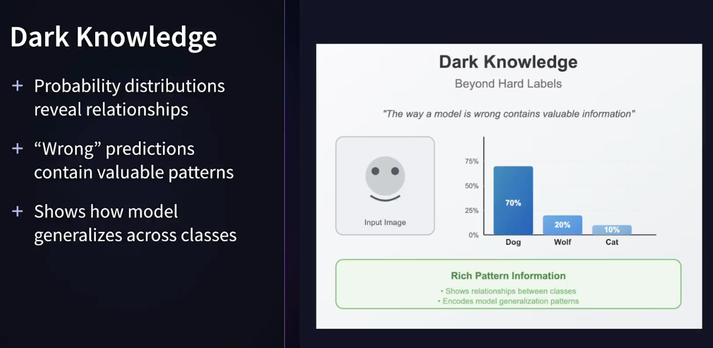

## Distillation

This section of the project examines **Knowledge Distillation** of Neural Network models through a worked out example notebook. The notebook and materials are part of the LinkedIn Learning Course: [Ai Model Compression Techniques: Building Cheaper, Faster, and Greener AI:](https://www.linkedin.com/learning/ai-model-compression-techniques-building-cheaper-faster-and-greener-ai), the Knowledge Distillation section.

---

### What is Knowledge Distillation?

Knowledge distillation is used to compress a complex and large neural network into a smaller and simpler one, while still retaining the accuracy and performance of the resultant model. This process involves training a smaller neural network to mimic the behavior of a larger and more complex "teacher" network by learning from its predictions or internal representations.

The goal of knowledge distillation is to reduce the memory footprint and computational requirements of a model without significantly sacrificing its performance. [[What is Knowledge Distillation? A Deep Dive.](https://blog.roboflow.com/what-is-knowledge-distillation/)]

  

[img source: knowledge distillation](https://www.linkedin.com/learning/ai-model-compression-techniques-building-cheaper-faster-and-greener-ai)

The process takes advantage of **Dark Knowledge**, the probability distribution relatiohnships between labels.

  

[img source: knowledge distillation](https://www.linkedin.com/learning/ai-model-compression-techniques-building-cheaper-faster-and-greener-ai)

And, knowledge transfer uses **Soft Targets**.

#### How Does Knowledge Distillation Work? [taken from: [What is Knowledge Distillation? A Deep Dive.](https://blog.roboflow.com/what-is-knowledge-distillation/)]

Knowledge distillation involves two main steps: training the teacher network and training the student network.

During the first step, a large and complex neural network, or the teacher network, is trained on a dataset using a standard training procedure. Once the teacher network has been trained, it is used to generate "soft" labels for the training data, which are probability distributions over the classes instead of binary labels. These soft labels are more informative than hard labels (i.e., the specific labels usually hot encoded by a learning model) and capture the uncertainty and ambiguity in the predictions of the teacher network.

In the second step, a smaller neural network, or the student network, is trained on the same dataset using the soft labels generated by the teacher network. The student network is trained to minimize the difference between its own predictions and the soft labels generated by the teacher network.

The intuition behind this approach is that the soft labels contain more information about the input data and the teacher network's predictions than the hard labels. Therefore, the student network can learn to capture this additional information and generalize better to new examples.

As shown below, a small “student” model learns to mimic a large “teacher” model and leverage the knowledge of the teacher to obtain similar or higher accuracy.

  

[img source](https://arxiv.org/abs/2006.05525?ref=blog.roboflow.com) - The teacher-student framework for knowledge distillation

### Temperature Scaling In Model Code - Helps Control Soft Target Distribution

  

[img source: knowledge distillation](https://www.linkedin.com/learning/ai-model-compression-techniques-building-cheaper-faster-and-greener-ai)

### Distillation Loss

  

[img source: knowledge distillation](https://www.linkedin.com/learning/ai-model-compression-techniques-building-cheaper-faster-and-greener-ai)

### Feature Distillation

  

[img source: knowledge distillation](https://www.linkedin.com/learning/ai-model-compression-techniques-building-cheaper-faster-and-greener-ai)

---

### References

[Shrinking the Giants: How knowledge distillation is Changing the Landscape of Deep Learning Models](https://medium.com/@zone24x7_inc/shrinking-the-giants-how-knowledge-distillation-is-changing-the-landscape-of-deep-learning-models-83dffde577ec)

[What is Knowledge Distillation? A Deep Dive.](https://blog.roboflow.com/what-is-knowledge-distillation/)
