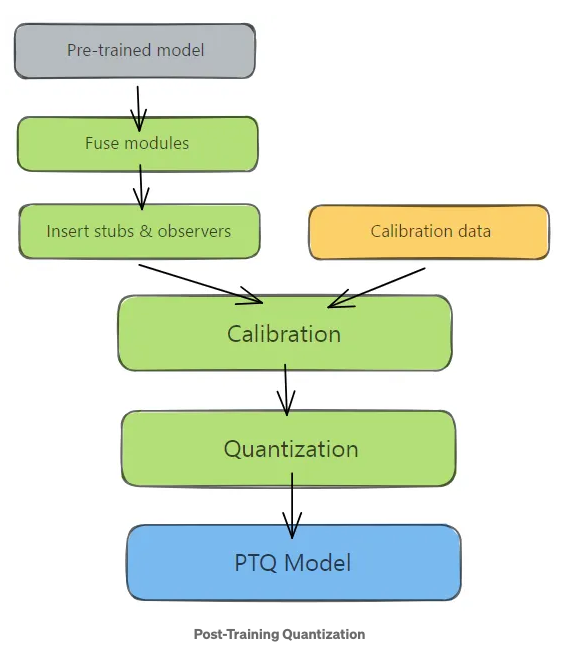
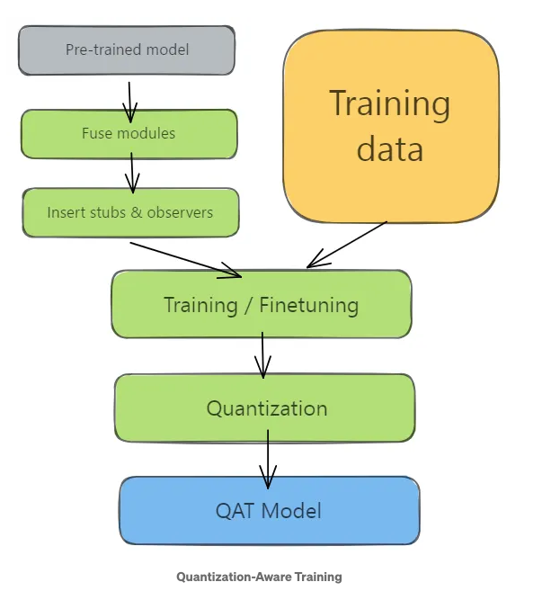
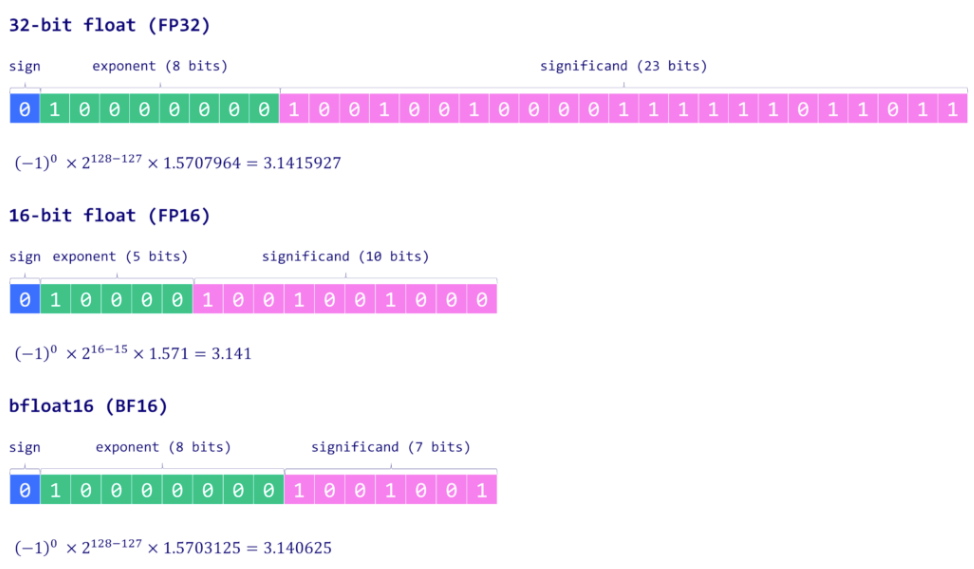
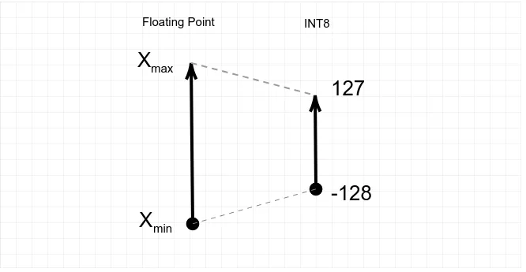

## A Primer on Quantization: The Mathematics Behind Quantization and Dequantization

In this directory, I explore what is quantization in the context of Neural Networks. I specifically explore the derivation of the quantization and dequantization equations.

Please note, this README file is quite extensive, but I believe it provides substantial value to educate the users on Quantization and how it applies to Neural Networks. It is supporting material not provided in the LinkedIn course which originated this project.

### What is Quantization?

Quantization techniques help make neural networks usable when there are constraints on memory or computation power, by trading some precision. Neural networks weights are usually trained in memory and computation-heavy floating point representations. With Quantization, we transform the weights into low precision representations (usually 8-bits), which use significantly less memory.

Specifcially, Large Language Models (LLMs) are known for their extensive computational requirements. Typically, the size of a model is calculated by multiplying the number of parameters (**size**) by the precision of these values (**data type**). However, to save memory, weights can be stored using lower-precision data types through a process, you guessed it, quantization.[Introduction to Weight Quantization](https://towardsdatascience.com/introduction-to-weight-quantization-2494701b9c0c/)

There are two main families of weight quantization techniques in the literature:

- **Post-Training Quantization** (PTQ): a straightforward technique where the weights of an already trained model are converted to lower precision without necessitating any model retraining. Although easy to implement, PTQ is associated with potential performance degradation. PTQ quantization can occur either **statically** or **dynamically**

  - **Static Quantization**: Quantizes weights and activations to a lower precision after training the model.

  - **Dynamic Quantization**: Quantizes weights to a lower precision and dynamically quantizes activations during inference.

<p>
  
</p>

[img source](https://medium.com/@0chandansharma/quantization-and-dequantization-explained-with-examples-and-mathematics-ecd48bdc55f1)

- **Quantization-Aware Training** (QAT): incorporates the weight conversion process during the pre-training or fine-tuning stage, resulting in enhanced model performance. However, QAT is computationally expensive and demands representative training data. Quantization occurs during training to make the model robust to quantization errors, typically resulting in higher accuracy compared to post-training quantization, but at high computational demands

<p>
  
</p>

[img source](https://medium.com/@0chandansharma/quantization-and-dequantization-explained-with-examples-and-mathematics-ecd48bdc55f1)

### What is Zero-Point Quantization?

For the notebooks in this section, I utilize **zerop-point** quantization. Zero-point quantization is a technique that transforms the original floating point number range (FP32) into an 8-bit range (INT8).

Floating point numbers are predominantly employed in deep learning due to their ability to represent a wide range of values with high precision. Typically, a floating point number uses n bits to store a numerical value. These _n_ bits are further partitioned into three distinct components:

- **Sign**: The sign bit indicates the positive or negative nature of the number. It uses one bit where 0 indicates a positive number and 1 signals a negative number.

- **Exponent**: The exponent is a segment of bits that represents the power to which the base (usually 2 in binary representation) is raised. The exponent can also be positive or negative, allowing the number to represent very large or very small values.

- **Significand/Mantissa**: The remaining bits are used to store the _significand_, also referred to as the _mantissa_. This represents the significant digits of the number. The precision of the number heavily depends on the length of the _significand_.

The formula looks like

$(-1)^{sign} \times base^{exponent} \times significand$

#### Looking at the Data Types

Delving into some of the most commonly used data types in deep learning: **float32 (FP32)**, **float16 (FP16)**, and **bfloat16 (BF16)**:

- **FP32** uses 32 bits to represent a number: one bit for the sign, eight for the exponent, and the remaining 23 for the significand. While it provides a high degree of precision, the downside of FP32 is its high computational and memory footprint.

- **FP16** uses 16 bits to store a number: one is used for the sign, five for the exponent, and ten for the significand. Although this makes it more memory-efficient and accelerates computations, the reduced range and precision can introduce numerical instability, potentially impacting model accuracy.

- **BF16** is also a 16-bit format but with one bit for the sign, eight for the exponent, and seven for the significand. BF16 expands the representable range compared to FP16, thus decreasing underflow and overflow risks. Despite a reduction in precision due to fewer significand bits, BF16 typically does not significantly impact model performance and is a useful compromise for deep learning tasks.

Here are the above representations:

<p>
  
</p>

[img source](https://towardsdatascience.com/introduction-to-weight-quantization-2494701b9c0c/)

FP32 is often termed "full precision" (4 bytes), while BF16 and FP16 are "half-precision" (2 bytes).

INT8, 8-bit representation, provides a way to store NN weights using a single byte which is capable of storing $2^8 = 256$ different values.

8-bit integer range using 2's complement: `[-128,127]`

The range here refers to the range of **signed** bytes using [2's complement](http://en.wikipedia.org/wiki/2%27s_complement). Two's complement is the most common method of representing signed (positive, negative, and zero) integers on computers.

```
01111111 = +127
01111110 = +126
01111101 = +125
...
00000001 = +1
00000000 =  0
11111111 = -1
...
10000010 = -126
10000001 = -127
10000000 = -128
```

Two's complement uses the most significant bit as the sign to indicate positive (0) or negative (1) numbers, and nonnegative numbers are given their unsigned representation (6 is 0110, zero is 0000); however, in two's complement, negative numbers are represented as the bit complement of their magnitude plus 1 (−6 is 1010).

When, I am discussing zero-point quantization, I am referring to converting FP32 weights into an INT8 format.

### 8-Bit Quantization

Zero-point quantization is considered an asymmetric quantization technique because it does not necessarily center the quantized range around zero. It allows the zero point to be shifted, meaning the zero value in the quantized representation doesn't always correspond to zero in the original floating-point data.

Symmetric quantization means the zero point is fixed at zero.

Zero-point quantization pair well for Neural Networks considering that activation functions in NN's like Rectified Linear Unit (ReLU) output asymmetric outputs (only positive values in ReLU's case).

Zero-point quantization uses re-scaling and shifting to project the FP range of tensors into the 8-bit range. Scaling and shifting are linear transformation operations.

We take the minimum and maximum of the components of the tensors, and use them as the endpoints of the new scale, which gets projected to the integer range from -128 to 127.

<p>
  
</p>

[img source](https://medium.com/@luis.vasquez.work.log/zero-point-quantization-how-do-we-get-those-formulas-4155b51a60d6)

To perform this transformation, we need to find a **scaling factor** and an **offset**:

$$
INT8 = \text{scale factor} \times FP + offset \qquad(1)
$$

#### Finding the Scaling Factor

To find the scaling factor we use the fact that the value at the bottom of the scale on the left has to be mapped to the bottom of the scale on the right, and the same applies to the value at the top of the scale.
Apply equation (1) to both endpoints to derive two new equations

$$
-128 = \text{scale factor} \times X_{min} + offset \qquad(2)
$$

$$
127 = \text{scale factor} \times X_{max} + offset \qquad(3)
$$

Subtracting equation (3) by equation (2), we can solve for **scaling factor**.

$$
127 - (-128) = \text{scale factor} \times (X_{max} - X_{min}) + (offest - offset)
$$

$$
255 = \text{scale factor} \times (X_{max} - X_{min}) \qquad(4)
$$

Rearranging equation (4), we can get the scaling factor:

$$
\text{scale factor} = \frac{255}{(X_{max} - X_{min})} \qquad(5)
$$

#### Finding the Offset

Using equation (2):

$$
-128 = \text{scale factor} \times X_{min} + offset \qquad(2)
$$

$$
offset = \text{scale factor} \times X_{min} - 128
$$

Now, plugging-in the scale factor:

$$
offset = \frac{255}{(X_{max} - X_{min})} \times X_{min} - 128 \qquad(6)
$$

Because equation (1) projects into the `integer` range from -128 to 127, it means that the right side of equation (1) needs to be integer numbers. So to start, lets round the offest.

$$
offset = -round(\text{scale factor} \times X_{min}) - 128 \qquad(7)
$$

$$
offset = -round(\frac{255}{(X_{max} - X_{min})} \times X_{min})- 128 \qquad(8)
$$

Equation (8) ensures that the offest will be an integer number. Now, we have to go back to equation (1) and round the rest of the right side

$$
INT8 = \text{scale factor} \times FP + offset \qquad(1)
$$

$$
INT8 = round(\text{scale factor} \times FP + offset) \qquad(9)
$$

because we rounded the offset

$$
INT8 = round(\text{scale factor} \times FP) + offset \qquad(10)
$$

#### Show Offset is the Zero-Point value

The zero-point is the integer number that the floating point zero value gets mapped to during quantization.

If we plug FP = 0 into equation (1), then we get:

$$
\text{zero-point} = \text{scale factor} \times 0 + offset
$$

$$
\text{zero-point} = offset \qquad(11)
$$

$$
\text{zero-point} = -round(\text{scale factor} \times X_{min}) - 128 \qquad(12)
$$

The zero-point is the offest of the transformation.

#### In Summary

In zero-point quantization, the input floating point (FP) values are `scaled` by the total range of values (255) divided by the difference between the maximum and minimum FP values.

The distribution is then shifted by the zero-point to map it into the range [-128, 127].

Both of these operations produce the **scale** and **zeropoint** values.

$$ \text{scale factor} = \frac{255}{max(X) - min(X)} $$

$$ zeropoint = -round(\text{scale factor} \cdot min(X)) -128 $$

### Dequantization

After quantizing, how do we obtain the original values from the floating point representation? Well, we can’t, because we have lost precision after rounding. However, we can obtain an approximation of the original values.

Let's rearrange equation (1):

$$
INT8 = \text{scale factor} \times FP + offset \qquad(1)
$$

to obtain the formulat for de-quantization:

$$
FP = \frac{INT8 - offset}{\text{scale factor}}  \qquad(13)
$$

Notice, equation (13) does not perform rounding because we are looking for a floating point, FP, value!

---

## Summarizing Zero-Point Quantization and Dequantization Equations

The Quantization Equation:

$$
INT8 = round(\text{scale factor} \times FP) + \text{zero-point} \qquad(14)
$$

The Dequantization Equation

$$
FP = \frac{INT8 - \text{zero-point}}{\text{scale factor}}  \qquad(15)
$$

Both equations because of the zero-point and scale factor depend on the input NN tensors. This dependence is because of the maximum and minimum values components of the tensor. Additionally, it is important to point out that for dequanitization that it is necessary to store the scale factor and zero-point values from the quantization step.

---

## References

[Affine Transformation](https://www.youtube.com/watch?v=AheaTd_l5Is)

[Introduction to Weight Quantization](https://towardsdatascience.com/introduction-to-weight-quantization-2494701b9c0c/)

[Zero-point quantization : How do we get those formulas?](https://medium.com/@luis.vasquez.work.log/zero-point-quantization-how-do-we-get-those-formulas-4155b51a60d6)

[AI Model Compression-Quantizatin and Dequantization Explained with Examples and Mathematics ](https://medium.com/@0chandansharma/quantization-and-dequantization-explained-with-examples-and-mathematics-ecd48bdc55f1)

[Practical Quantization in PyTorch](https://pytorch.org/blog/quantization-in-practice/)

[Motivation behind the zero-point quantization and formula derivation, giving a clear interpretation of the “zero-point”](https://medium.com/@luis.vasquez.work.log/zero-point-quantization-how-do-we-get-those-formulas-4155b51a60d6)
