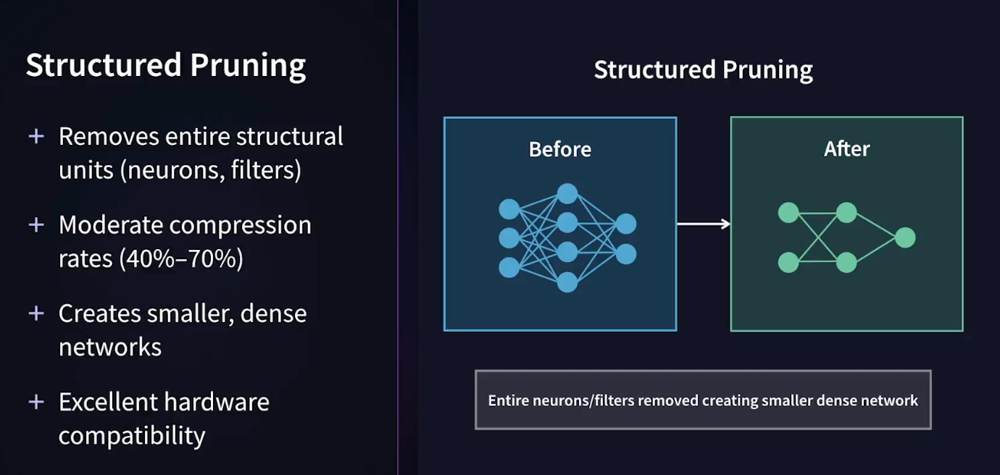

## Pruning

This section of the project examines Pruning of Neural Network models through a worked out example notebook. The notebook and materials are part of the LinkedIn Learning Course: [Ai Model Compression Techniques: Building Cheaper, Faster, and Greener AI:](https://www.linkedin.com/learning/ai-model-compression-techniques-building-cheaper-faster-and-greener-ai), the Pruning section.

---

### Why Pruning?

Model pruning refers to the act of removing unimportant parameters from a deep learning neural network model to reduce the model size and enable more efficient model inference. Generally, only the weights of the parameters are pruned, leaving the biases untouched. The pruning of biases tends to have much more significant downsides [[A Comprehensive Guide to Neural Network Model Pruning]](https://datature.io/blog/a-comprehensive-guide-to-neural-network-model-pruning).

<p>
  
</p>

[img source: pruning section](https://www.linkedin.com/learning/ai-model-compression-techniques-building-cheaper-faster-and-greener-ai)

### When Should You Prune Your Model? [[A Comprehensive Guide to Neural Network Model Pruning]](https://datature.io/blog/a-comprehensive-guide-to-neural-network-model-pruning).

Pruning models is particularly beneficial in deployment scenarios where computational resources are constrained or efficiency is critical.

- **Edge Devices:** Deploying models on edge devices such as smartphones, IoT devices, or embedded systems often requires lightweight models due to limited computational resources, memory, and power constraints. Pruning can significantly reduce the model size and computational complexity, making it feasible to deploy on such devices without sacrificing performance.

**Real-Time Applications:** In applications where low latency is crucial, such as real-time video analysis, autonomous vehicles, or speech recognition, pruning can help reduce the inference time of the model. By removing redundant parameters or connections, the pruned model requires fewer computations, leading to faster inference without compromising accuracy.

**Cloud Services:** Even in cloud-based deployment scenarios, where computational resources may be more abundant, pruning can still be beneficial for cost savings and scalability. Smaller models require fewer resources to deploy and maintain, leading to reduced infrastructure costs and improved scalability, especially in scenarios with high demand or elastic workloads.

**Mobile Applications:** Mobile applications often have limited storage space and processing power, making it challenging to deploy large models. Pruning allows developers to create more lightweight models that can be integrated into mobile apps without significantly impacting performance or user experience.

**Embedded Systems:** In scenarios where models are deployed on embedded systems for tasks such as industrial automation, robotics, or sensor data analysis, pruning can help optimize resource utilization and improve energy efficiency. This is critical for prolonging the battery life of battery-powered devices and reducing energy consumption in resource-constrained environments.

**Bandwidth-Constrained Environments:** In deployment scenarios where bandwidth is limited, such as remote locations or IoT deployments with intermittent connectivity, smaller models resulting from pruning require less data transmission during deployment and inference, leading to faster and more reliable communication.

### How does it compare with quantization?

Pruning generally is more surgical in compressing and streamlining models than other methods such as quantization, which is just bluntly removing precision from model weights.

Neural networks tend to have a specific subset of parameters that are essential for prediction. Model pruning is a very intuitive approach to model compression, with the hypothesis that effective model compression should remove weights that aren’t being used, similarly to how the brain reduces usage of connections between neurons to emphasize important pathways [[A Comprehensive Guide to Neural Network Model Pruning]](https://datature.io/blog/a-comprehensive-guide-to-neural-network-model-pruning).

### Two Main Approaches to Pruning Neural Networks [[A Comprehensive Guide to Neural Network Model Pruning]](https://datature.io/blog/a-comprehensive-guide-to-neural-network-model-pruning).

The approaches are based on when the pruning process occurs in relation to the training of the model. Both `train-time pruning` and `post-training pruning` aim to reduce the size and computational complexity of neural networks, but they differ in when the pruning decisions are made relative to the training process.

- **Train-time Pruning:**

  - Train-time pruning involves integrating the pruning process directly into the training phase of the neural network. During training, the model is trained in a way that encourages sparsity or removes less important connections or neurons as part of the optimization process. This means that the pruning decisions are made simultaneously with the weight updates during the training iterations.

  - Train-time pruning can be implemented using techniques such as _regularization_ methods like **L1** or **L2** regularization, where the penalty terms encourage sparsity, or by incorporating pruning masks into the optimization process.

- **Post-traing Pruning:**
  - Post-training pruning, as the name suggests, involves pruning the trained model after it has been fully trained without considering pruning during the training process. Once the model has been trained to convergence, pruning techniques are applied to identify and remove less important connections, neurons, or entire structures from the trained model. This is typically applied as a separate step after training has been completed.

A good starting point is typically to implement **post-training pruning**, since you can immediately prune any existing models without having to add complexity to your training pipeline and re-train the model from scratch. If any accuracy degradation caused by the pruning process is not ideal even after fine-tuning your model, you can consider **train-time** pruning instead.

#### Types of Post-Training Pruning

##### Unstructured Pruning:

Unstructured pruning is a simpler, more naive approach to pruning, but is an accessible method with low barriers to entry. General approaches to unstructured pruning use minimum thresholds depending on the raw weights themselves or their activations to determine whether the individual parameter should be pruned or not. If the parameter fails to meet the threshold, it is zeroed out. As unstructured pruning involves zeroing individual weights within the weight matrices, this means that all calculations prior to model pruning would be performed, and thus there is minimal latency improvement. On the other hand, it can help in denoising model weights for more consistent inference as well as aid in reducing model size lossless model compression. Unlike structured pruning, which certainly cannot be used without contextual information and adaptation, unstructured pruning can generally be used out of the box without too much risk.[[A Comprehensive Guide to Neural Network Model Pruning]](https://datature.io/blog/a-comprehensive-guide-to-neural-network-model-pruning).

<p>
  
</p>

[img source: pruning section](https://www.linkedin.com/learning/ai-model-compression-techniques-building-cheaper-faster-and-greener-ai)

##### Structured Pruning:

Structured pruning is a more ambitious, architecturally minded approach to pruning. By removing entire structured groups of weights, the method reduces the scale of calculations that would have to be made in the forward pass through the model’s weights graph. This process has real improvements for model inference speed and model size[[A Comprehensive Guide to Neural Network Model Pruning]](https://datature.io/blog/a-comprehensive-guide-to-neural-network-model-pruning).

<p>
  
</p>

[img source: pruning section](https://www.linkedin.com/learning/ai-model-compression-techniques-building-cheaper-faster-and-greener-ai)

### Pruning Criteria

Here area a few criteria to decide on how to prune.

<p>
  
</p>

[img source: pruning section](https://www.linkedin.com/learning/

### The Pruning Schedule Matter

Pruning can be done in **one-shoot**, removing all targeted weights in a single operation or via **iterative pruning**, gradually removing weights with fine-tuning between steps.

<p>
  
</p>

[img source: pruning section](https://www.linkedin.com/learning/ai-model-compression-techniques-building-cheaper-faster-and-greener-ai)

---

### Fine-tuning After Pruning May be Needed to Improve Accuracy

Generally, fine-tuning a model is the process of taking a pre-trained machine learning model and further training it on a specific dataset to adapt it to a particular task or domain. Essentially, it's like taking a general-purpose model and teaching it to become an expert in a specific area.

In this case, we are taking the pre-trained model that has been pruned and training the model again to adapt to the remaining connections. Basically, we are re-calculating the remaining weight values using a very low learning rate to avoid large weight swings and also applying only a small number of training epochs.

<p>
  
</p>

[img source: pruning section](https://www.linkedin.com/learning/ai-model-compression-techniques-building-cheaper-faster-and-greener-ai)

<br>

It is important to keep in mind the **Pruning Rate vs the Fine-Tuning Epochs**. The greater the pruning the more fine-tuning epoches are required.

<p>
  
</p>

[img source: pruning section](https://www.linkedin.com/learning/ai-model-compression-techniques-building-cheaper-faster-and-greener-ai)

---

### Combine Techniques: Pruning + Quantization

<p>
  
</p>

[img source: pruning section](https://www.linkedin.com/learning/ai-model-compression-techniques-building-cheaper-faster-and-greener-ai)

---

### Summary of the Layer Based Pruning Notebook --Results from Pruning and Fine Tuning:

The notebooks shows that structured pruning followed by Fine-Tuning delivers the best model with the greatest accuracy, reduced inference time, and saves the most memory in megabytes (MB).

```
--- Summary ---
Model              | Accuracy | Inference Time | Size (MB) | Non-zero/Total Params
--------------------|----------|----------------|-----------|--------------------
Original            | 99.08%   | 1.9307s        | 1.61    | 421642/421642 (100.0%)
Unstructured Pruned | 98.19%   | 1.8993s        | 1.61    | 210938/421642 (50.0%)
+ Fine-tuned        | 99.17%   | 1.8972s        | 1.61    | 210938/421642 (50.0%)
Structured Pruned   | 98.63%   | 1.6492s        | 0.78    | 201849/201849 (100.0%)
+ Fine-tuned        | 99.16%   | 1.6424s        | 0.78    | 201849/201849 (100.0%)

```

---

### Here are Guidelines to Help Decide which Pruning Method to Use

<p>
  
</p>

[img source: pruning section](https://www.linkedin.com/learning/ai-model-compression-techniques-building-cheaper-faster-and-greener-ai)

<br>

<p>
  
</p>

[img source: pruning section](https://www.linkedin.com/learning/ai-model-compression-techniques-building-cheaper-faster-and-greener-ai)

---

### Additional References

[A Comprehensive Guide to Neural Network Model Pruning](https://datature.io/blog/a-comprehensive-guide-to-neural-network-model-pruning)

[Introduction to Pruning](https://medium.com/@anhtuan_40207/introduction-to-pruning-4d60ea4e81e9)

[The Lottery Ticket Hypothesis: Finding Sparse, Trainable Neural Networks” (Frankle and Carbin, 2019)](https://arxiv.org/abs/1803.03635)

The Lottery Ticket Hypothesis, proposed by Jonathan Frankle and Michael Carbin, suggests that within a randomly initialized, dense neural network, there exists a smaller, sparse subnetwork, called a "winning ticket," that can be trained in isolation to achieve the same or better performance as the original dense network. Essentially, it proposes that a randomly initialized network contains subnetworks that are inherently better suited for training, acting like a "winning ticket" in a lottery. In essence, the Lottery Ticket Hypothesis challenges the conventional view that larger, denser networks are always superior. It suggests that within these large networks, there are hidden, smaller subnetworks that hold the key to efficient and effective training.
