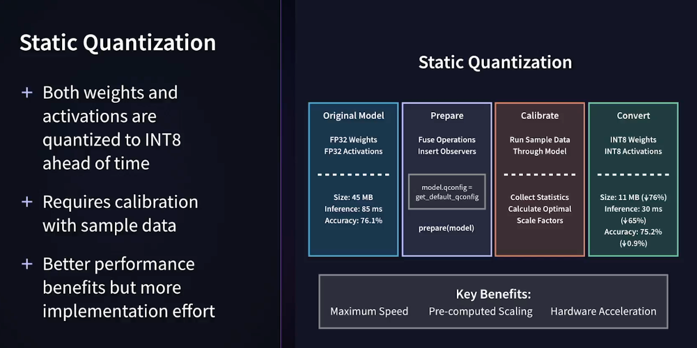

## Static and Dynamic Quantization

This section of the project examines Static, Dynamic, and Quantization-Aware Training (QAT) Quantization through a worked out example notebook. The notebook and materials are part of the LinkedIn Learning Course: [Ai Model Compression Techniques: Building Cheaper, Faster, and Greener AI:](https://www.linkedin.com/learning/ai-model-compression-techniques-building-cheaper-faster-and-greener-ai), the quantization section.

---

### Dynamic Quantization - Quantizes Weights Post-Training: Activations quantized during inference

It is the easiest of the techniques to implement. It reduces neural network model size, speeds up model inference, but losses some accuracy compared to the original non-quantized model.

The following figure summarizes the key results:

<p>
  
</p>

[img source: static and dynamic section](https://www.linkedin.com/learning/ai-model-compression-techniques-building-cheaper-faster-and-greener-ai)

---

### Static Post-Training Quantization (PTQ)

Static quantization is more complicated as it requires three steps:

- `preparation` of the model where "fuse operations" and "insertion of observers" are accomplished,

- `calibration` of the model with sample data to collect statistics to calculate optimal scale factors, and finally the

- `convert` step where both weight and activations are quantized from FP32 to INT8 (i.e., converting the calibrated model in step two to its final quantized form).

**Fuse Operations (Module Fusion)**

Refers to combining layers for efficiency: This involves grouping multiple sequential layers, such as a convolutional layer followed by a BatchNorm layer and a ReLU activation function ([Conv2d, BatchNorm, ReLU]), into a single, fused module.

Leads to _faster inference_. Instead of executing three separate operations, the fused module is treated as a single operation by the hardware, which reduces memory accesses and improves computational efficiency. Plus, it improves accuracy because fusing operations can help reduce quantization error by preventing intermediate values from being quantized and dequantized between each operation.

**Insertion of Observers**

Refers to collecting activation statistics. In static quantization, the goal is to determine fixed quantization parameters (scale factors and zero-point) for activations before inference.

Observer modules are strategically placed within the model at points where activations will be quantized. During a calibration phase, a representative dataset (not the entire training dataset) is passed through the prepared model. Observers record the distribution (e.g., min and max values) of the activations at their respective locations. Determining quantization parameters: Based on the observed activation distributions, algorithms determine optimal scale factor and zero-point values for each layer to map the floating-point activation ranges to integer ranges.

Static PTQ reduces neural network model size, speeds up model inference, and increases model accuracy compared to the original non-quantized model.

The following figure summarizes the key results:

<p>
  
</p>

[img source: static and dynamic section](https://www.linkedin.com/learning/ai-model-compression-techniques-building-cheaper-faster-and-greener-ai)

---

## Implemented Models WorkFlow

Both the dynamic and static models follow the same general workflow:

- Load a pre-trained model with a set of test data

- Apply either dynamic or static quantization methods

- Measure and compare performance of each model to the original non-quantized model performance.

- Performance measures used for comparisons

  - _Model size in bytes_ to show storage efficiency
    Involves multiplying the size of the data type (e.g., torch.int8, toch.quint8 for quantized weights/activations, torch.float32 for non-quantized parts) for each element and then summing up the sizes to arrive at the model size. Luckily, PyTorch has functions that make this easy to do.

  - _inference time_ per batch to demonstrate performance improvements

  - _accuracy_ on the a test set of data to measure any impact on model quality.

---

## Training and Baseline Model Performance

The notebooks will use a standard approach with the `Adam Optimizer` and `Cross Entropy Loss`.

Training only uses a subset of 10,000 randomly selected images from a training set based on the CIFAR_10 dataset using `5 epochs`

In the real-world, in a production setting, I would use the full dataset and train with more epochs.

The following figure provides a sample of functions and baseline performance. Performance will vary based on the platform that the notebooks are run upon.

<p>
  
</p>

[img source: static and dynamic section](https://www.linkedin.com/learning/ai-model-compression-techniques-building-cheaper-faster-and-greener-ai)

---

### Quantization-Aware Training (QAT)

QAT quantizes a pre-trained NNs and then retrains it. This retraining phase allows the model to adjust and learn how to work efficiently with the newly quantized values. This approach is especially useful when a sufficient amount of training data is available, as the additional training can help mitigate potential accuracy losses that occur during quantization[ [TinyML — Quantization Aware Training](https://medium.com/@thommaskevin/tinyml-quantization-aware-training-b4f29cdde787)]

<p>
  
</p>

[img source: static and dynamic section](https://www.linkedin.com/learning/ai-model-compression-techniques-building-cheaper-faster-and-greener-ai)

#### Why use QAT?

Quantization in the other methods reduce inference times and bytes sizes, but may reduce model accuracy. QAT aims to reduce inference times and byte sizes while maintaining or improving accuracy. High-precision applications can take advantage of this technique.

Accuracy gets improved by QAT from an original model because the quantization constraints act as a form of regularization during training.

Recall regularization in neural networks helps prevent overfitting and improve the model's ability to generalize to unseen data. Overfitting occurs when a model learns the training data too well, including noise and specific patterns that do not generalize to new examples. Regularization addresses this by introducing mechanisms that encourage simpler models and discourage overly complex representations. Additionally, regularization can stabilize the training process by preventing weights from becoming excessively large, which can lead to numerical instability and difficulty in convergence during optimization.

Common regularization techniques include L1 and L2 regularization (which penalize the absolute or squared values of weights, respectively), Dropout (which randomly deactivates neurons during training), and Data Augmentation (which expands the training dataset by creating modified versions of existing data).

The downside of QAT is that it requires significantly more engineering effort.

The figure below provides a side by side comparion of QAT to Post-Training Quantization

<p>
  
</p>

[img source: static and dynamic section](https://www.linkedin.com/learning/ai-model-compression-techniques-building-cheaper-faster-and-greener-ai)

QAT implementation involves the following steps:

<p>
  
</p>

---

### When and Where to Use Each Quantization Technique

|     Quantization Method     |                        When to Use It                        |           Where to use it           |
| :-------------------------: | :----------------------------------------------------------: | :---------------------------------: |
|           Dynamic           |                      Quick Deployments                       |      Non-critical Applications      |
|           Static            | For Constrained Applications Where You Have Calibration Data | Mobile and Edge Device Applications |
| Quantization-Aware Training |                    High-precision Systems                    |    Mission Critical Applications    |

---

## Data Set Used for in the notebook

<p>
  
</p>

[img source: static and dynamic section](https://www.linkedin.com/learning/ai-model-compression-techniques-building-cheaper-faster-and-greener-ai)

---

### Notebook results: Comparing the Quantization Techniques

```
================================================================================
QUANTIZATION COMPARISON SUMMARY
================================================================================
Model Type                Size (MB)       Accuracy        Inference (ms)  Speedup
--------------------------------------------------------------------------------
Original FP32 (CPU)       18.31           0.5246          42.73           1.00      x
Dynamic Quantization      5.70            0.5245          44.65           0.96      x
Static Quantization       4.59            0.5255          22.45           1.90      x
QAT                       4.61            0.5626          22.47           1.90      x
================================================================================
```

---

## References

[TinyML — Quantization Aware Training](https://medium.com/@thommaskevin/tinyml-quantization-aware-training-b4f29cdde787)]
